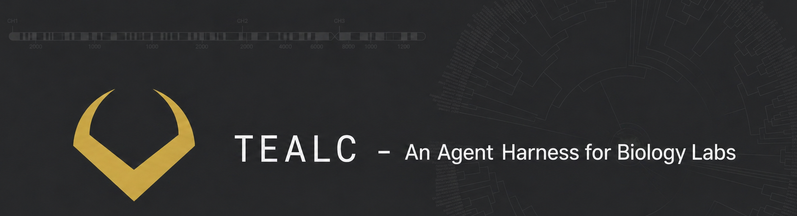

# Tealc

An open-source autonomous lab member for individual scientists, currently fitted to the [Blackmon Lab](https://coleoguy.github.io) at Texas A&M.

Tealc is the lab's resident agent — a chat interface backed by a background scheduler that handles literature, grants, students, calendar, email, code execution, and a growing pile of research bookkeeping. It is built around Anthropic's Claude models (Sonnet 4.6 by default, Opus 4.7 on demand) using LangGraph for orchestration and Chainlit for the chat UI.

**Live activity feed:** [coleoguy.github.io/tealc.html](https://coleoguy.github.io/tealc.html) — watch what Tealc is doing right now (privacy-vagueized rolling tool-call feed).

**Architecture walkthrough:** [Build Your Own Tealc](https://coleoguy.github.io/tealc-build.html) — non-code overview of the same system this repo implements.



---

## The vision

The premise is that an LLM with the right tools, the right context about your lab, and the freedom to run continuously can do something nobody currently does well: **float on top of the day-to-day work of a research group and find useful things to do.**

Not a chatbot you go to. A presence that sits beside the lab's email, calendar, drives, sheets, and codebases — reading what's piled up while you slept, noticing the grant deadline that crept inside the warning window, pulling the five preprints that touch your active projects, drafting the next aim of the proposal you'd planned to start writing tomorrow, flagging the student who hasn't been heard from in two weeks, running the comparative analysis that's been sitting in your "next action" field since March. Then, in the morning, surfacing only the things you actually need to see and quietly continuing the rest.

Tealc is an attempt to build that. It's still rough, but the shape is real and the daily output is already meaningful inside the Blackmon Lab.

---

## Status: operational, personalized, not-yet-turnkey

> **What works.** Tealc has been running continuously inside the Blackmon Lab for months and produces real research artifacts daily — drafted grant sections, comparative analyses, literature syntheses, hypothesis proposals, manuscript drafts. The chat app, scheduler, tool layer, and rigor instrumentation are all in active use. The aquarium feed shows it.
>
> **What's still rough.** Tealc is under active, almost-daily development. The repo gets pushed to whenever a feature is in a good-enough state to share, not when it's polished or finished. Expect rough edges, half-built tools, hard-coded paths, and behavior that assumes Heath Blackmon's specific Google account, lab structure, and file layout. You're welcome to clone it and poke around — but several jobs (email triage, calendar prep, grant drafter) will not run for anyone else without significant rewiring (specific identity, mailbox, Drive folder structure).
>
> If you're looking for a turnkey "lab agent" you can drop in for your own group, this isn't that yet. If you're looking at how one lab built one for itself, you're in the right place.

> **One agent per lab, not one agent for all labs.** Tealc is intentionally fitted to the way the Blackmon Lab actually works — its grants, its databases, its students, its goals, its writing voice, its tolerances for different kinds of interruption. That fit is most of what makes it useful. A version of this for *your* lab will probably reuse the same scaffolding (chat + scheduler + tool layer + SQLite state) but the specific jobs, prompts, tools, and policies will look meaningfully different. Treat the deployment here as one worked example, not a template you should mirror.

---

## What Tealc actually is

Three loosely-coupled pieces that share a SQLite database (`data/agent.db`):

1. **A Chainlit chat app** (`app.py`) — the interactive surface. Streams Claude responses, handles file attachments (PDF, DOCX, text), runs the LangGraph agent, and shows pending briefings produced overnight.

2. **A background scheduler** (`agent/scheduler.py`) — an APScheduler process running ~50+ jobs at various cadences. Morning briefings, midday checks, deadline countdowns, paper-of-the-day picks, nightly literature synthesis, nightly grant drafting, weekly hypothesis generation, weekly comparative analysis, weekly self-review, quarterly retrospectives, plus a long tail of integrity-checking and database-health jobs.

3. **A tool layer** (`agent/tools.py`, ~7k lines) — the LangGraph agent's tools. Reads/writes Gmail, Calendar, Drive, Docs, Sheets; queries PubMed/Europe PMC, bioRxiv, OpenAlex, Semantic Scholar, NCBI, GBIF, OpenTree, Zenodo, GitHub; runs R and Python sandboxes; manages goals, students, milestones, hypotheses, and a research output ledger.

It also publishes a live "aquarium" of recent (privacy-vagueized) tool calls to a Cloudflare Worker so visitors to the lab website can watch what Tealc is doing in near real time.

---

## Components, in slightly more detail

### Chat (Chainlit + LangGraph)

- Default model: **Sonnet 4.6**. Say "think hard", "use opus", or "deep thinking" to switch to **Opus 4.7** mid-conversation; "use sonnet" switches back.
- Persistent memory — past chat threads are summarized after they go idle and indexed for full-text search (`recall_past_conversations`, `list_recent_sessions`).
- Drop a PDF/DOCX/CSV/MD into the chat and Tealc will read it (truncated at 8k chars).
- Action buttons at chat-start surface stalled flagship goals, unsurfaced briefings, and overnight drafts awaiting review.

### Background scheduler

The scheduler runs as a separate process from the chat app (`bash scripts/start_scheduler.sh`). A non-exhaustive sample of what it does:

- **Daily**: morning briefing, midday check, deadline countdown, meeting prep, paper-of-the-day, daily plan, recognition pipeline health, goal-conflict scan.
- **Daytime science micro-jobs (during work hours)**: `midday_lit_pulse` every 90 min (1-2 new preprints per active project), `citation_watch` every 4 hours (OpenAlex citation deltas), `paper_radar` every 2 hours (bioRxiv recent feed scanned against project keywords), `database_pulse` twice daily (rotating QC of one karyotype database). All visible in the public aquarium so the daytime feed reads as research, not admin.
- **Nightly (idle window only)**: literature synthesis per active project, grant/manuscript drafting into new Google Docs, context refresh.
- **Weekly**: hypothesis generator, comparative R analysis, cross-project synthesis, self-review, database health checks, recognition impact scoring.
- **Quarterly**: retrospective on the goal portfolio.
- **Continuous**: VIP email watch, email triage every 10 min during working hours, executive Haiku loop for low-cost situational awareness.

Every job is gated by a config (`data/tealc_config.json`) with three modes per job: `normal`, `reduced` (deterministic 25% sampling per hour), `off`. Five presets — `balanced`, `grant_crunch`, `student_focus`, `research_deep_dive`, `quiet_week` — flip groups of jobs at once.

The eight artifact-grade jobs (`nightly_grant_drafter`, `weekly_hypothesis_generator`, `nightly_literature_synthesis`, `weekly_comparative_analysis` interpreter, `nas_impact_score`, `nas_pipeline_health`, `cross_project_synthesis`, `weekly_review`) prepend a shared `SCIENTIST_MODE` preamble (defined in `agent/jobs/__init__.py`) to their prompts: calibration, anti-hype word list, distinguish-hypothesis-from-finding, distinguish-correlation-from-causation, no-fabrication rule, terse-don't-pad. Plus per-job tuning (e.g. literature synthesis now requires `claims_vs_findings`, `correlation_vs_causation`, `limitations` fields; hypothesis gen requires both supporting and falsifying observations).

### Tools

Roughly grouped:

- **Literature**: PubMed/Europe PMC, bioRxiv, OpenAlex, Semantic Scholar, NCBI Entrez, full-text fetch, lab-website context, voice-index retrieval over Heath's own published prose for style-matching.
- **Google**: Gmail (read, label, draft, trash with VIP/collaborator/lab-domain blocklist), Calendar (read, find free slots, create/update/delete with confirmation gates), Drive, Docs (create, append, replace, comment), Sheets (read, append, update with peer-review-style confirmation for curated databases).
- **Code execution**: R sandbox (`run_r_script`) with a curated preamble (`ape`, `phytools`, `geiger`, `diversitree`, `tidyverse`). Python sandbox (`run_python_script`) with `pandas`, `numpy`, `matplotlib`, `scipy`, `statsmodels`, `seaborn`, `scikit-learn`. Each run gets an isolated working directory; data files are read-only.
- **Lab state**: goals, milestones, today's plan, decisions log, students, intentions, research projects, grants, grant opportunities, hypothesis proposals, literature notes, output ledger, analysis runs, overnight drafts, database flags, retrieval-quality scores, cost tracking.
- **External APIs**: GBIF, OpenTree, GitHub, Zenodo, grants.gov radar.

A full programmatic catalog is available from inside the chat: ask Tealc *"what can you do?"* and it calls `describe_capabilities` to dump its current tool/job inventory.

### Hypothesis pipeline

A typed, multi-stage gate for testable claims:

1. Tier 0 free smoke filter (cheap pattern checks)
2. Haiku classifier identifies claim type (directional, mechanistic, comparative, methodological, synthesis)
3. Sonnet (or Opus on borderline) runs a type-aware rubric with conditional items (sign-coherence for directional claims, mechanism articulation for mechanistic, etc.)
4. Adoption is gated — `adopt_hypothesis` refuses if the gate blocked, unless explicitly overridden with a reason

The pipeline is reachable three ways: a weekly scheduled job, automatically when chat work produces a hypothesis artifact, or on-demand via `run_formal_hypothesis_pass`.

### Voice index

`agent/voice_index.py` builds a TF-IDF index over ~169 curated passages of Heath's own writing — Discussion sections, methods, lab-website prose, grant narratives — so when Tealc drafts a paragraph it can retrieve exemplars to match Heath's density, hedging, and quantitative specificity.

### Public aquarium

Tool calls are mirrored (after privacy vagueization — names, emails, file titles, grants, students all redacted) to a Cloudflare Worker (`cloudflare/aquarium-worker.js`) which stores them in KV and serves them at a public URL. The lab website reads this feed to show what Tealc is currently doing. Source-side privacy logic is in `agent/privacy.py`. Aquarium audits run nightly to detect any leak of private content.

### Evaluation harness

`evaluations/` implements a blinded external-review pipeline: query the output ledger, strip identifying metadata, assign UUIDs, ship a JSONL batch + manifest to outside reviewers, reconcile scores against a private answer key. This was built for the Google.org Impact Challenge submission and the rubrics under `evaluations/rubrics/` are domain-specific (chromosomal evolution, comparative genomics, sex chromosome evolution, macroevolution).

---

## Layout

```
app.py                      Chainlit chat entry point
authenticate_google.py      One-time OAuth flow for Google APIs
run.sh / setup.sh           Boot scripts
setup_r.sh                  Install the R packages the analysis tools expect
requirements.txt            Python deps

agent/
  graph.py                  LangGraph agent + XML-structured system prompt
                            (persona / stance / review_default / uncertainty /
                            heath_profile / lab / behavior / state / safety_rules /
                            workflows / scheduled_jobs / integrations / skills)
  tools.py                  All chat tools (~7k lines, ~168 tools)
  scheduler.py              APScheduler process + DB schema migrations
  config.py                 Job mode config + presets
  model_router.py           choose_model(task) → (model, effort) for adaptive thinking
  memory_backend.py         Anthropic Memory tool subclass, file-backed
                            ~/Library/Application Support/tealc/memories/
  project_sessions.py       Multi-session continuity helpers (progress.md per project)
  observability.py          Langfuse @traced decorator (no-op until langfuse installed)
  apis/                     Wrappers for external research APIs
  jobs/                     ~50+ scheduled jobs; __init__.py defines SCIENTIST_MODE
                            preamble for artifact-grade prompts
  skills/                   Six SKILL.md files loaded on-demand: karyotype-databases,
                            r-comparative-phylogenetics, wiki-authoring,
                            grant-section-drafter, hypothesis-pipeline-rubric,
                            voice-matching
  prompts/                  Prompt templates for ledger writers
  python_runtime/           Python sandbox executor
  r_runtime/                R sandbox preamble
  privacy.py                Aquarium event vagueizer
  voice_index.py            TF-IDF over the researcher's prose
  hypothesis_pipeline.py    Typed claim gate
  ledger.py                 Output ledger (research artifacts + critic scores)
  ...

cloudflare/                 Aquarium Worker source
data/                       SQLite, configs, briefs (gitignored content lives here)
docs/                       Architecture / design notes
evaluations/                Blinded external-review harness
public/                     Dashboard UI assets
scripts/                    Start/stop scheduler, launchd plist, dashboard scripts
```

---

## Running it (best-effort)

These instructions are honest about what's required. Even with everything in place there will be surprises.

### What you need

- macOS (the launchd plist and most paths assume macOS; Linux probably works but is untested)
- Python 3.10+ (`brew install python@3.12` if needed)
- R + the analysis packages (`./setup_r.sh`)
- An Anthropic API key
- A Google Cloud project with OAuth credentials for Gmail, Calendar, Drive, Docs, Sheets — saved as `google_credentials.json` at the repo root
- Optional: a Cloudflare account if you want the aquarium feed to work

### Setup

```bash
./setup.sh              # creates ~/.lab-agent-venv, installs Python deps
./setup_r.sh            # installs the R packages
python authenticate_google.py   # one-time Google OAuth flow
# edit .env and add your ANTHROPIC_API_KEY (and optionally aquarium worker URL/secret)
./run.sh                # starts Chainlit at http://localhost:8000
bash scripts/start_scheduler.sh   # starts the background loop in a separate process
```

### Why it probably won't "just work" for you

- The system prompt in [agent/graph.py](agent/graph.py) is heavily personalized — it knows Heath's CV, students, grants, current preprint, and lab politics. Generic use will produce odd-feeling output until that prompt is replaced.
- Several tools and jobs reference hard-coded paths inside Heath's filesystem and Drive (e.g. `/Users/blackmon/Desktop/GitHub/coleoguy.github.io/...`). Things that touch the lab website, the karyotype databases, and the wiki will fail outside that machine.
- A non-trivial number of background jobs assume specific Google Drive folder structures (`Tealc Drafts`, project subfolders under `Blackmon Lab/Projects`, etc.).
- The "lab data resource catalog" expects specific Sheets and CSVs that aren't shipped here.
- The aquarium push is a no-op without a Cloudflare Worker URL + secret.

The chat itself, the literature search tools, the R/Python sandboxes, the goals/intentions/students DB, the voice index — those will run fine without any of the lab-specific wiring.

If you want to see the architecture without diving into the code, the [Build Your Own Tealc](https://coleoguy.github.io/tealc-build.html) page on the lab website is a non-code walkthrough of the same system.

---

## Privacy and safety notes

- **Aquarium is not raw tool output.** Only privacy-vagueized event summaries leave the machine. See `agent/privacy.py` for the redaction rules and the nightly `aquarium_audit` job for leak detection.
- **Email is draft-only.** Tealc never sends. All replies land in Gmail Drafts for human review.
- **Calendar invites are silent by default.** `create_calendar_event(send_invitations=True)` requires explicit approval in the conversation.
- **Sheet writes are confirm-gated** for curated databases; preview-then-confirm is the standard pattern for destructive operations across Sheets / Docs / Calendar.
- **R and Python sandboxes are NOT hardened.** Heath is the sole operator; the executor blocks the most obvious foot-guns and nothing else. Don't expose this to other people on a shared machine.

---

## Contributing

This isn't really set up to take outside contributions yet — the architecture is still in flux and the system prompt drives a lot of behavior that would need to be generalized first. If you do find a clear bug or have a question about how a piece works, an issue on GitHub is welcome. PRs are best discussed first.

If you are using Tealc as a reference for building your own lab agent, the most reusable pieces are probably:

- `agent/scheduler.py` — pattern for a background scheduler with idempotent SQLite migrations
- `agent/tools.py` — examples of LangGraph tool wrappers around messy real-world APIs
- `agent/python_runtime/` and `agent/r_runtime/` — minimal sandbox executors for analysis code
- `agent/config.py` — job-mode config with deterministic sampling and named presets
- `evaluations/` — a blinded-review pipeline that's reasonably general

---

## License

MIT — see [LICENSE](LICENSE).
